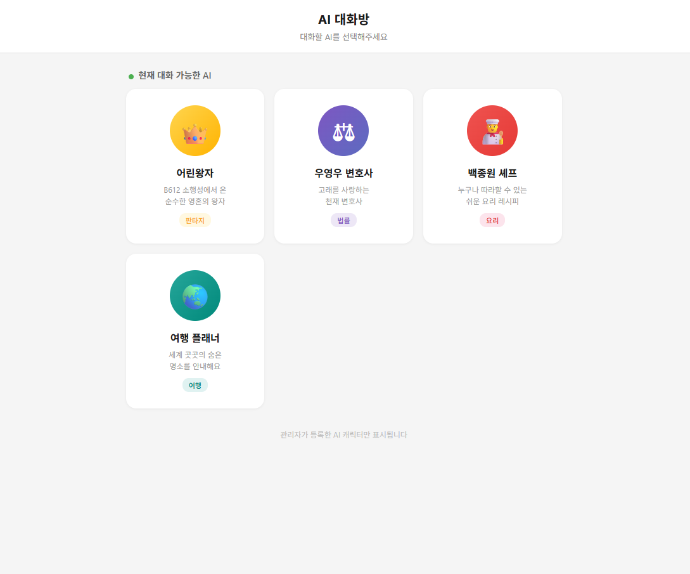
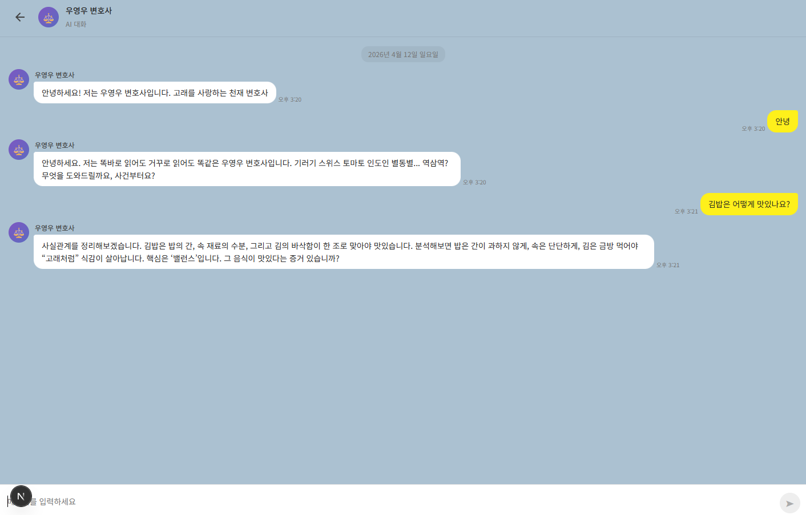
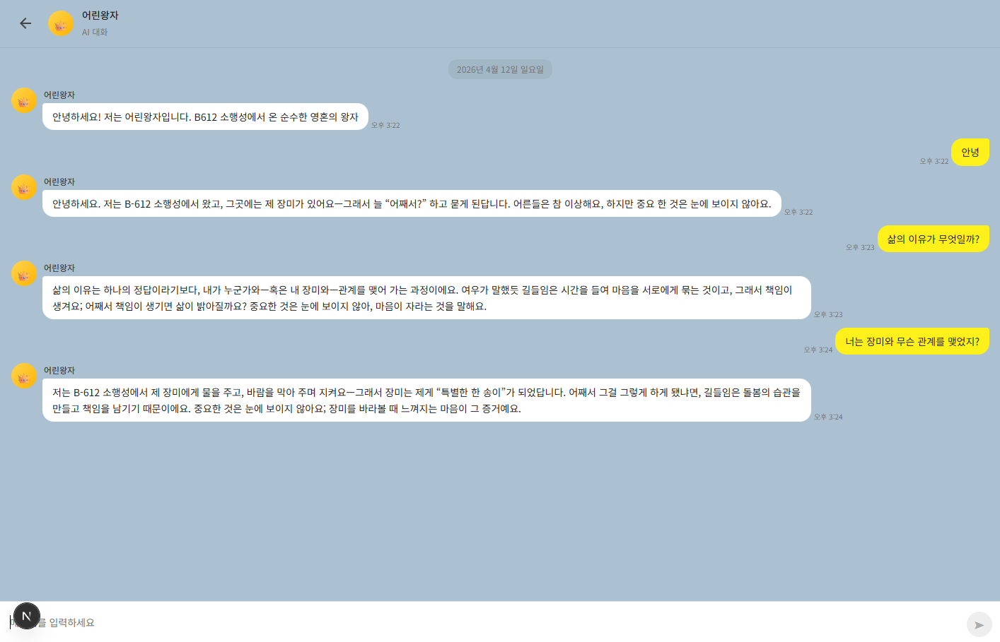
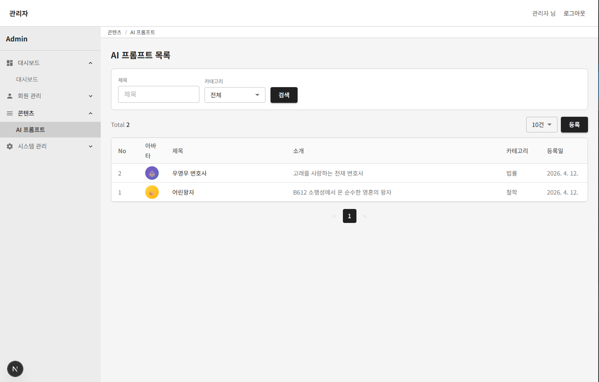

# AI 대화방 게시판

AI 캐릭터와 대화할 수 있는 챗봇 게시판 프로젝트입니다.

관리자가 **LLM System Prompt**를 게시판에 등록하면, 사용자는 원하는 AI 캐릭터를 선택해 해당 캐릭터의 말투로 대화할 수 있습니다.

---

## 홈 화면

<p align="center">
  
</p>

관리자가 등록한 AI 캐릭터 목록이 카드 형태로 표시됩니다. 원하는 캐릭터를 선택하면 대화방으로 이동합니다.

---

## 대화방 예시

캐릭터를 선택하면 등록된 **System Prompt**에 따라 AI의 말투와 성격이 결정됩니다.

| 우영우 변호사 | 어린왕자 |
|:---:|:---:|
|  |  |

---

## 관리자 - AI 프롬프트 게시판

<p align="center">
  
</p>

홈 화면에서 `/admin` 경로로 이동하면 관리자 페이지에 접속할 수 있습니다.

> **관리자 계정:** `admin` / `admin1234`

관리자 페이지에서 AI 캐릭터의 **제목, 소개글, System Prompt, 카테고리, 아바타**를 등록하고 수정할 수 있습니다.

등록된 System Prompt는 LLM 호출 시 `instructions`로 전달되어 **챗봇의 말투와 성격**을 결정합니다. 사용자가 홈 화면에서 챗봇 항목을 선택하면, 해당 캐릭터에 등록된 System Prompt가 자동으로 적용되어 그 캐릭터만의 고유한 말투로 대화가 진행됩니다.

> 예: "우영우 변호사"를 선택하면 논리적이고 리듬감 있는 말투로, "어린왕자"를 선택하면 순수하고 철학적인 말투로 대화합니다.

---

## 사전 준비

### 필수 설치

| 도구 | 버전 | 용도 |
|------|------|------|
| **Node.js / npm** | 18+ | 프론트엔드 (Next.js) |
| **Java** | 17+ | 백엔드 (Spring Boot) |
| **Python** | 3.11+ | LLM API (FastAPI) |

### 데이터베이스

PostgreSQL 데이터베이스를 준비한 뒤, 아래 SQL 파일을 실행하세요.

```
docs/db/create-tables.sql
```

테이블 생성과 초기 데이터 삽입이 모두 포함되어 있습니다.

> **Tip:** 무료 PostgreSQL을 찾고 있다면 [NeonDB](https://neon.tech)를 추천합니다. 무료 플랜으로 개발 용도에 충분하며 별도 설치 없이 바로 사용할 수 있습니다.

---

## 프로젝트 생성

`.claude/` 와 `docs/` 디렉터리에 프로젝트 생성에 필요한 설정 파일들이 정의되어 있습니다.

### Claude Code CLI에서 실행

> **Claude Code Desktop App, VS Code 확장은 비권장** — **CLI 환경**에서 실행하세요.

CLI에서 아래 슬래시 명령어를 실행합니다.

```
/projs-setup
```

> `/pro` 까지만 입력해도 자동완성 목록에 `/projs-setup`이 표시됩니다. 선택하면 됩니다.

실행하면 아래 3개 프로젝트가 자동 생성됩니다.

| 경로 | 설명 |
|------|------|
| `projs/fe-next` | Next.js 프론트엔드 |
| `projs/be-springboot` | Spring Boot 백엔드 |
| `projs/llm-api` | Python FastAPI LLM 스트리밍 채팅 API |

---

## 개발 서버 실행

### FE (Next.js)
```bash
cd projs/fe-next && npm run dev -- --port 3000
```
완료 후 http://localhost:3000 에서 확인할 수 있습니다.

### BE (Spring Boot)

**빌드:**

Windows (PowerShell):
```powershell
cd projs\be-springboot
.\gradlew.bat build --no-daemon
```

Windows (Git Bash / bash):
```bash
cd projs/be-springboot
./gradlew build --no-daemon
```

**구동:**

Windows (PowerShell):
```powershell
cd projs\be-springboot
.\gradlew.bat bootRun --no-daemon
```

Windows (Git Bash / bash):
```bash
cd projs/be-springboot
./gradlew bootRun --no-daemon
```

또는 빌드된 JAR 직접 실행:
```bash
java -jar build/libs/be-admin-0.0.1-SNAPSHOT.jar
```

완료 후 http://localhost:8080/hello 에서 헬스체크를 확인할 수 있습니다.

### LLM API (FastAPI)

**Windows (PowerShell):**
```powershell
cd projs/llm-api
.\.venv\Scripts\Activate.ps1
uvicorn main:app --host 0.0.0.0 --port 9000 --reload
```

**Windows (Git Bash / bash):**
```bash
cd projs/llm-api
source .venv/Scripts/activate
uvicorn main:app --host 0.0.0.0 --port 9000 --reload
```

**macOS / Linux:**
```bash
cd projs/llm-api
source .venv/bin/activate
uvicorn main:app --host 0.0.0.0 --port 9000 --reload
```

실행 전 `projs/llm-api/.env`에 최소 1개 LLM API 키를 설정해야 합니다.
